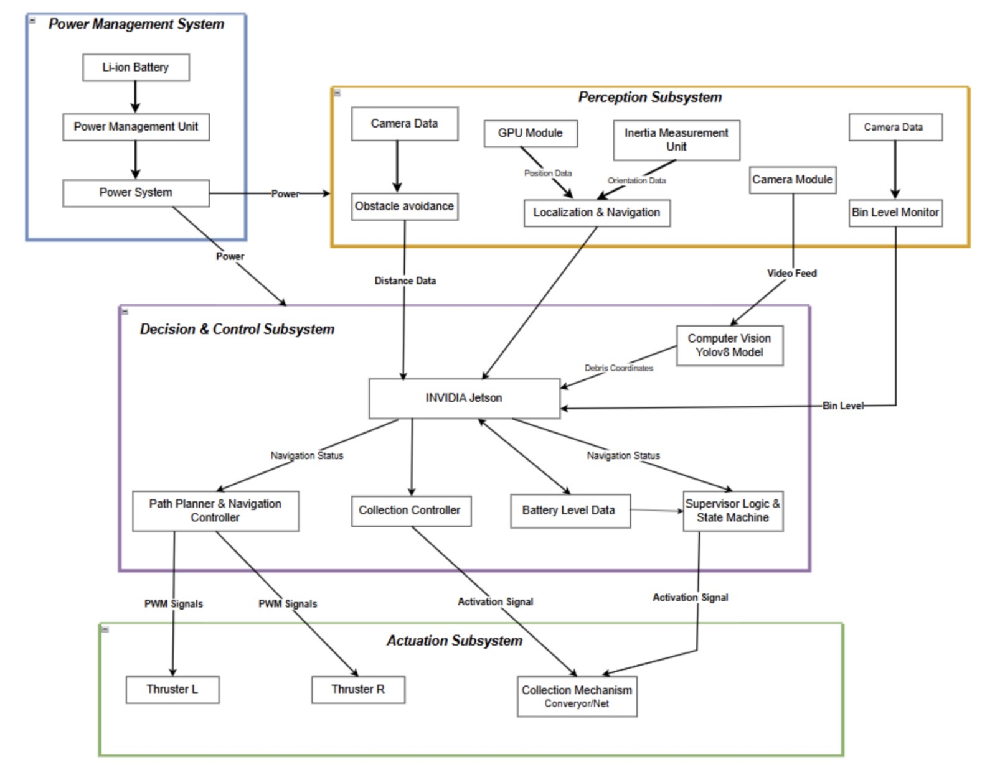
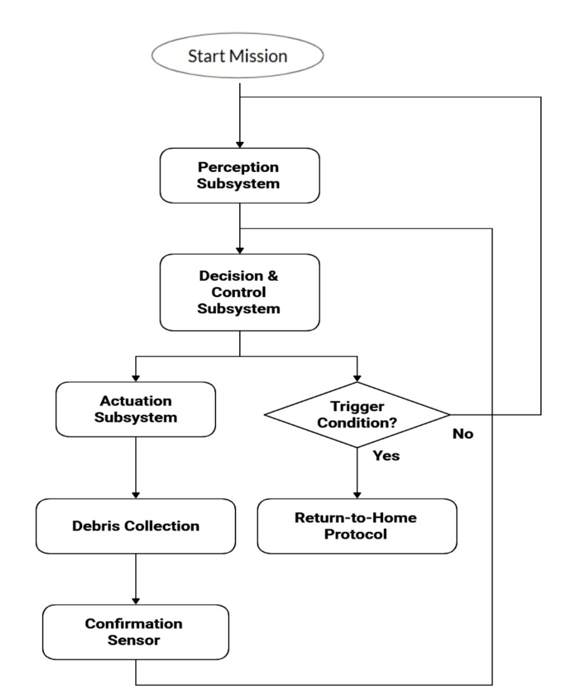
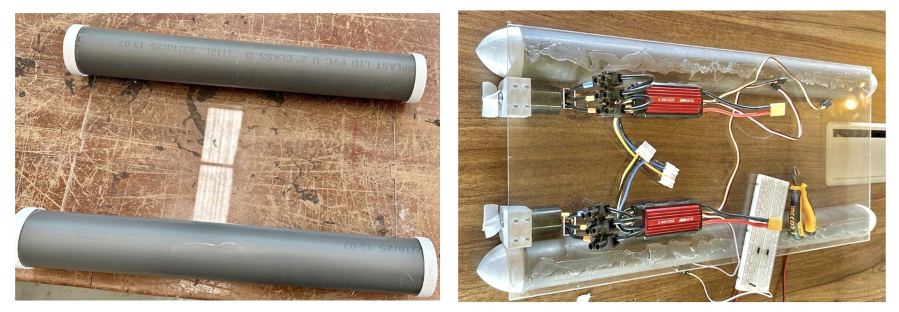
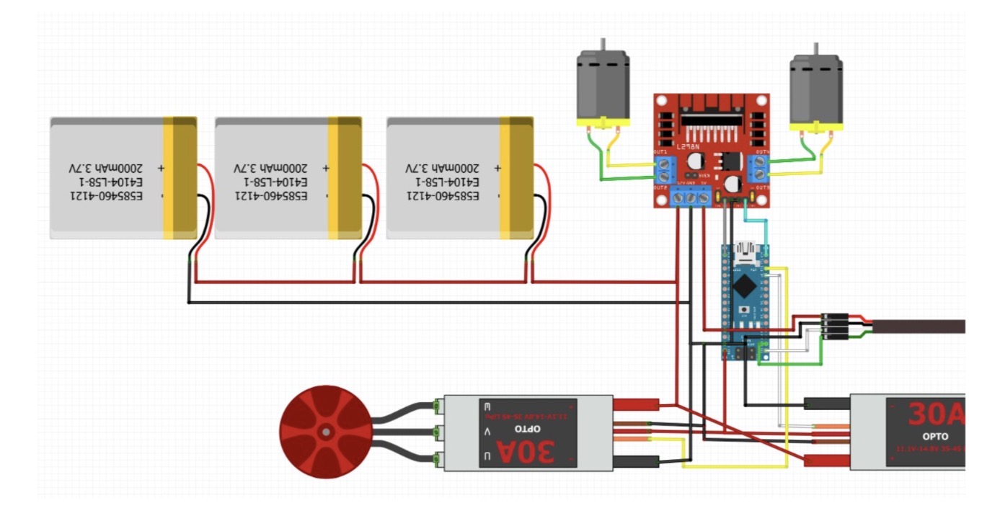
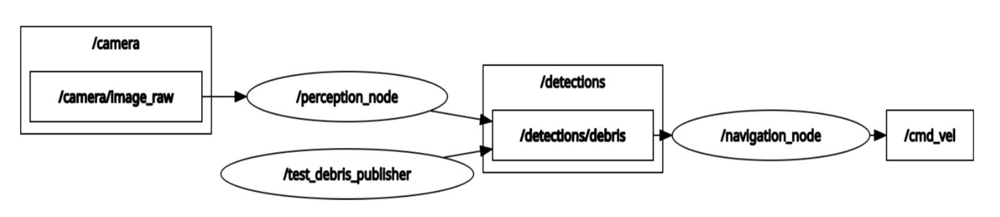
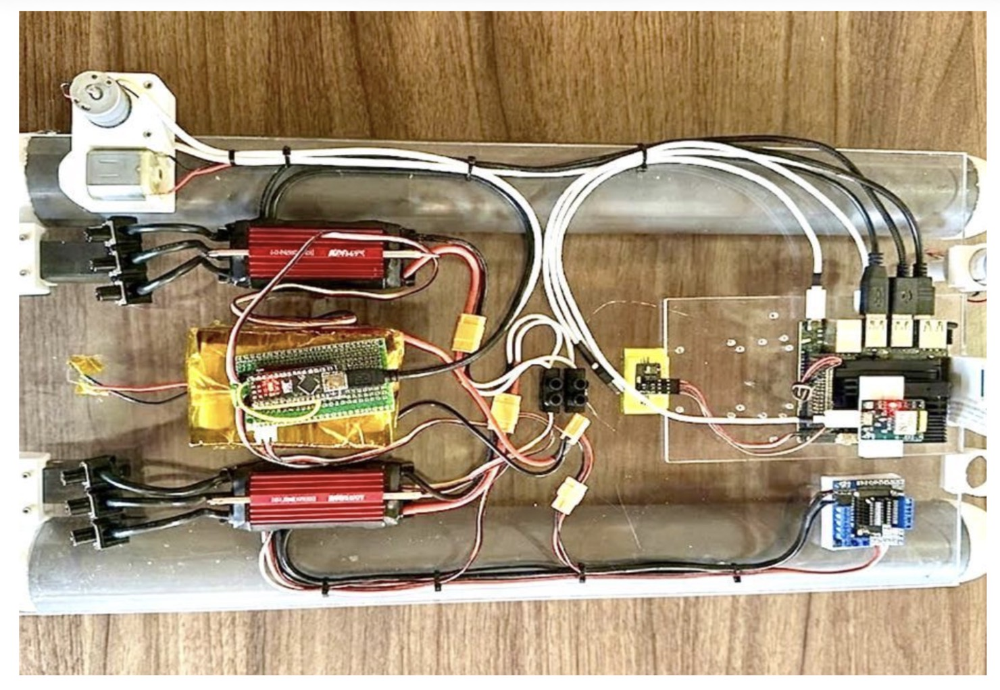
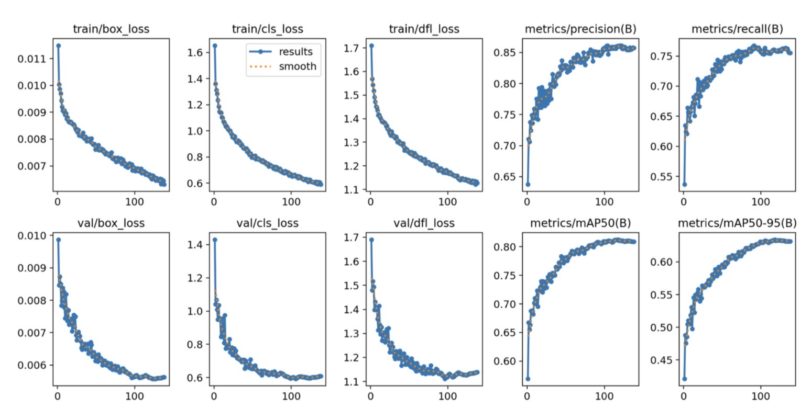

# 🌊 USV Autonomy: An Unsupervised Robotic System for Surface Water Debris Collection

<div align="center">

**A fully autonomous Unmanned Surface Vehicle (USV) that detects, approaches, and collects floating debris using YOLOv8 and ROS 2 — designed with cost-effective, locally available components for developing nations.**

[](https://docs.ros.org/en/humble/)
[](https://github.com/ultralytics/ultralytics)
[](https://developer.nvidia.com/tensorrt)
[](https://www.python.org/)
[](LICENSE)
[]()

</div>

---

## 📹 Live Demo

  [PROJECT DEMO](images/VIDEO-2026-05-04-13-11-40.mp4)
  <br>
  <em>Full autonomous mission: Search → Detect → Align → Collect → Return-to-Home</em>
</div>

---

## 📋 Executive Summary

**Problem:** Aquatic plastic pollution is devastating Ghana's urban water bodies. Current solutions rely on manual labor — slow, dangerous, and impossible to scale. Advanced robotic systems exist but are cost-prohibitive for developing nations.

**Solution:** This project presents a fully autonomous USV that combines real-time object detection (YOLOv8m, 0.839 mAP@50), intelligent navigation (ROS 2, hybrid coverage + obstacle avoidance), and a passive vortex collection mechanism — all built with locally available components and open-source software.

**Key Results:**
- **93.3%** debris collection success rate (10 trials, 30 target bottles)
- **96.7%** detection rate
- **100%** Return-to-Home success rate
- **10-15 FPS** inference on Jetson Nano (TensorRT FP16 optimized)
- **45+ minutes** operational endurance (5s5p 15,000 mAh battery)

**Significance:** This work demonstrates that meaningful autonomy can be achieved at a cost accessible to resource-constrained environments. It provides a replicable proof of concept for environmental robotics in developing nations where manual cleanup remains inadequate.

**Keywords:** Unmanned Surface Vehicle, YOLOv8, ROS 2, autonomous debris collection, embedded AI, environmental robotics

---

## 📚 Table of Contents

- [Live Demo](#-live-demo)
- [Executive Summary](#-executive-summary)
- [System Architecture](#-system-architecture)
- [Hardware](#-hardware)
- [Software Stack](#-software-stack)
- [Key Innovations](#-key-innovations)
- [Results](#-results)
- [The Engineering Journey](#-the-engineering-journey)
- [Future Work](#-future-work)
- [Author](#-author)

---
## 🏗️ System Architecture

### Overview

The system operates through a continuous cycle of **perception, decision, and action**:


### Operational Workflow

The robot follows a deterministic Finite State Machine (FSM) sequence:



---
## ⚙️ Hardware

### Bill of Materials

| Component | Model/Specification | Purpose | Cost (USD) |
|-----------|---------------------|---------|------------|
| **Compute** | NVIDIA Jetson Nano (Model P3450) | 128-core Maxwell GPU, 4GB RAM | $99 |
| **Camera** | Raspberry Pi Camera Module V2 | 8MP, 640×480 @ 30 FPS | $25 |
| **GPS** | NEO-7M | 2-3m accuracy, 1Hz UART output | $20 |
| **IMU** | MPU-6050 (accelerometer only) | 3-axis acceleration, 10Hz | $5 |
| **Thrusters** | 2× Brushless DC Water Jet | 12V, 5kg thrust each | $80 |
| **ESC** | 2× ZTW Shark 50A | Waterproof, 50A rating | $60 |
| **Battery** | Custom 5s5p Li-ion | 12.6V nominal, 15,000 mAh | $40 |
| **Collection Box** | 6.5" PETG 3D-printed | Passive vortex inlet | $10 |
| **Chassis** | 2" PVC pipe + Acrylic sheet | Custom catamaran | $20 |
| **Buck Converter** | Custom | 12.6V → 5V | $10 |
| **Wiring** | XT60 connectors, XH connectors | Power + data | $15 |

**Total:** ~$384 USD

### Fabrication

The USV is a custom catamaran platform:
- **Dimensions:** 60 cm × 30 cm (30 cm hull spacing)
- **Hulls:** 2-inch diameter PVC pipes
- **Deck:** 5 mm clear acrylic
- **3D-printed components:** PETG filament (motor mounts, sensor brackets, collection box, electronics enclosure)



## 🔌 Circuit Diagram

The circuit diagram shows the complete electrical integration of the system, including power distribution and data flow between components.


  <br>
  <em><strong>Figure 1:</strong> System circuit diagram showing power distribution (blue) and data flow (green). The 5s5p battery (12.6V) directly powers the thrusters and feeds a buck converter supplying 5V to the Jetson Nano and sensors.</em>
</div>

### Power Distribution

| Component | Voltage | Source |
|-----------|---------|--------|
| Thrusters (2×) | 12.6V | Direct from battery |
| ESCs (2×) | 12.6V | Direct from battery |
| Jetson Nano | 5V @ 3A | Buck converter |
| Raspberry Pi Camera V2 | 5V | Buck converter |
| NEO-7M GPS | 5V | Buck converter |
| MPU-6050 IMU | 5V | Buck converter |

### Data Flow

| Interface | Components | Protocol |
|-----------|------------|----------|
| CSI-2 | Camera → Jetson | Video stream |
| UART | GPS → Jetson | NMEA sentences |
| I2C | IMU → Jetson | Acceleration data |
| USB | Jetson → Arduino | Serial commands |
| PWM | Arduino → ESCs | Thruster control |
---

## 💻 Software Stack

### Technologies

| Component | Technology | Version |
|-----------|------------|---------|
| Operating System | Ubuntu | 22.04 LTS |
| Framework | ROS 2 | Humble |
| Object Detection | YOLOv8m | 8.0.0 |
| GPU Optimization | NVIDIA TensorRT | 8.6 |
| Deep Learning | PyTorch | 2.0.0 |
| Computer Vision | OpenCV | 4.8.0 |
| Programming Languages | Python, C++ | 3.10, 17 |

### Key Innovations

| Innovation | Description | Impact |
|------------|-------------|--------|
| **Camera-based verification** | YOLOv8 confirms debris is no longer visible after collection | Eliminates need for IR sensors |
| **Optical flow obstacle avoidance** | Detects expanding pixel regions between frames | Eliminates need for ultrasonic/LiDAR |
| **Passive vortex collection** | Cutout geometry creates low-pressure zone; no moving parts | Zero power consumption |
| **Software counter fill-level** | Counter increments on each successful collection | Eliminates physical bin sensors |
| **GPS-accelerometer fusion** | Dead reckoning with periodic GPS correction | Avoids expensive IMU |

### ROS 2 Node Graph



---
## 📊 Results



### Detection Performance

| Metric | Result | Target | Status |
|--------|--------|--------|--------|
| mAP@50 | **0.839** | > 0.65 | ✅ Exceeded |
| Precision | **0.844** | > 0.70 | ✅ Exceeded |
| Recall | **0.797** | > 0.60 | ✅ Exceeded |
| F1-Score | **0.820** | > 0.65 | ✅ Exceeded |
| Inference Speed | **10-15 FPS** | > 10 FPS | ✅ Met |



### Class-wise Performance

| Class | mAP@50 | Precision | Recall | F1-Score |
|-------|--------|-----------|--------|----------|
| garbage | 0.652 | 0.721 | 0.581 | 0.643 |
| aquatic_animal | 0.871 | 0.843 | 0.816 | 0.829 |
| plants | 0.995 | 0.969 | 0.993 | 0.981 |
| **All Classes (Average)** | **0.839** | **0.844** | **0.797** | **0.820** |

### Integrated System Performance

| Metric | Result | Target | Status |
|--------|--------|--------|--------|
| Collection Success Rate | **93.3%** | > 70% | ✅ Exceeded |
| Detection Rate | **96.7%** | — | — |
| Return-to-Home Success Rate | **100%** | 100% | ✅ Met |
| Mission Completion Rate | **100%** | > 80% | ✅ Exceeded |
| Operational Endurance | **45+ minutes** | > 15 min | ✅ Exceeded |
| Cross-Track Error | **< 0.5 m** | < 0.3 m (sim) | ✅ Acceptable |

### Trial Results


| Trial | Target Bottles | Detected | Collected | Time (min) | RTH Trigger |
|-------|---------------|----------|-----------|------------|-------------|
| 1 | 3 | 3 | 3 | 18 | Timer |
| 2 | 3 | 3 | 3 | 17 | Timer |
| 3 | 3 | 3 | 3 | 19 | Timer |
| 4 | 3 | 3 | 3 | 16 | Timer |
| 5 | 3 | 2 | 2 | 18 | Timer |
| 6 | 3 | 3 | 3 | 20 | Timer |
| 7 | 3 | 3 | 2 | 17 | Timer |
| 8 | 3 | 3 | 3 | 18 | Timer |
| 9 | 3 | 3 | 3 | 19 | Timer |
| 10 | 3 | 3 | 3 | 42 | Battery |
| **Total** | **30** | **29** | **28** | — | — |

---
## 🧠 The Engineering Journey

The Moment Everything Changed

This project fundamentally changed how I think about AI engineering. Here is why:

- 1. Training a model is easy. Deploying it is not.

I trained a YOLOv8m model on an A100 GPU (0.839 mAP@50). It was perfect. Then I tried to deploy it on the Jetson Nano. It crashed. Over and over.

The problem: TensorRT optimization requires memory buffers that exceed the Nano's 4GB RAM. The ONNX model (98.9 MB) expanded to over 1.2 GB during conversion.

The fix: I forced FP16 precision, set workspace=1024 (1 GB limit), and fixed a PyTorch 2.0 → TensorRT 8.5 version mismatch. The model now runs at 10-15 FPS.

- 2. ROS 2 theory is not practice.

In class, ROS sounded straightforward: nodes publish messages, topics carry data. Then I tried to implement it.

I spent three days unable to make two nodes communicate. The tutorials worked in isolation but failed when combined. I learned to use the CLI tools obsessively: ros2 topic list, ros2 topic echo, ros2 interface show. They became my lifeline.

The critical insight: Custom message types (Debris.msg) are not just code—they are a contract between nodes. Defining them forced me to think clearly about what data I was actually passing.

- 3. Hardware is not forgiving.

I am a Computer Science student. Hardware was a mystery. I learned the hard way:

· A motor that spins is not the same as a motor that spins correctly under load

· 12V → 5V sounds simple until you learn about current limits and heat dissipation

· A 3D-printed enclosure is not waterproof. I learned this the hard way

· I2C is not just "wires." I did not know about clock stretching or pull-up resistors

· Code is forgiving. Hardware is not. Every wire matters

The breakthrough: When the USV detected a bottle, aligned itself, approached it, and collected it without any human input—that was the moment I understood what AI engineering really means. It is not about the model. It is about the system.

---
## 🔭 Future Work

### Near-Term Improvements

· Physical fill-level sensing — Replace software counter with ultrasonic/IR sensor

· Multi-debris type training — Expand dataset to bags, wrappers, Styrofoam

· Dedicated obstacle avoidance sensor — Add low-cost ultrasonic for static obstacles

· Improved waterproofing — Pot electronics or use commercial IP-rated enclosures

### Mid-Term Extensions

· Autonomous docking and unloading — Automated station with debris suction/conveyor

· Solar charging integration — Extend endurance for tropical environments

· Water quality monitoring payload — Add pH, turbidity, dissolved oxygen sensors

· Multi-robot coordination — Fleet of USVs dividing search areas

### Long-Term Research Directions

· Adaptive path planning — Learn debris distribution, concentrate search in high-density areas

· Semantic segmentation — Pixel-level classification for precise debris localization

· Field deployment — Korle Lagoon, urban drainage canals, pond systems in Ghana

· Community-based monitoring — Cloud upload for tracking cleanup progress

---
## 👩‍💻 Author

- Ama Baduwa Baidoo
  
- 📍 Austin, Texas, USA
  
- 📧 [nanaamabaidoo6@gmail.com]


---
🙏 Acknowledgments
-  Dr. Grace Oletu — Supervisor, for expert guidance and encouragement to pursue a locally relevant problem

-  Mr. Barnabas Nomo — Co-Founder/CEO, Goliath Robotics, for practical robotics guidance

-   [Academic City University] — Faculty of Computational Sciences and Informatics

-   Family — For patience, encouragement, and belief in me throughout this journey

---
<div align="center">
  <sub>Built with ❤️ in Ghana</sub>
</div>
```---


